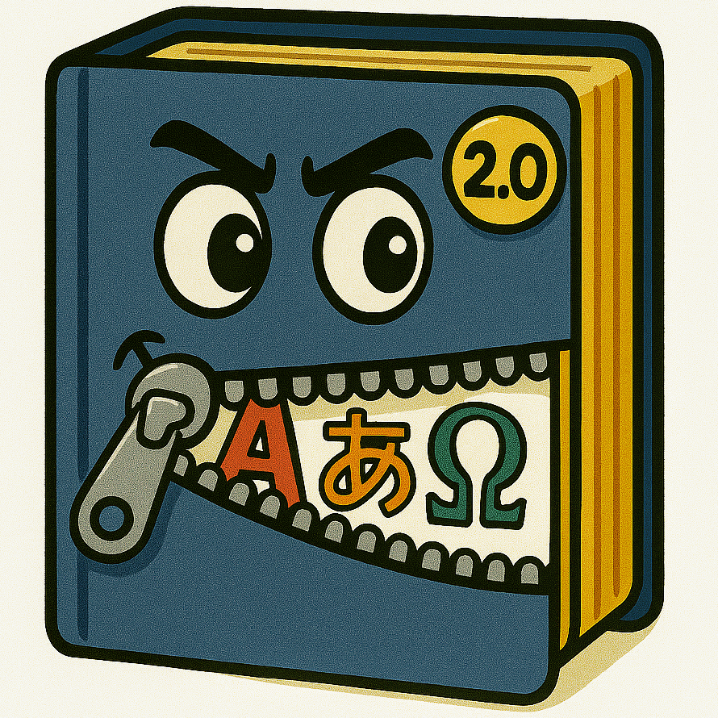

# Zippy the Dict 2.0!

## 🎯 Purpose

Zippy the Dict (it/its) extracts structured wordlists from multilingual dictionary formats (.dict.dz, .tei, StarDict, etc.) for use in the [Halt! What's the Passphrase?] project and other passphrase-generation tools. Zippy eats dictionaries and spits out wordlists.

Supported formats:
- .dz (gzipped dictionary files)
- .dictd.tar.xz (FreeDict archive format)
- .src.tar.xz (TEI XML source format)

---

## 🤖 Zippy Is The Future!

**Zippy the Dict 2.0** is not handcrafted, artisinal, or a pet. It is a product of AI code generation, refinement, and augmentation. It represents what a purely functional, AI-generated utility looks like when allowed to evolve through self-directed trial-and-error iteration under human guidance - and not very good guidance at that.

- **Every line** of Zippy was written and edited by multiple agentic coding system.
- There is no human-authored logic, structure, or flow.
- Zippy is *not pretending* to be a traditionally engineered tool.
- Zippy is proud of every one of its big beautiful lines of code - there will be no code-shaming here. And y'all need to stop saying "code vomit" like it's a bad thing 🤮

---

## 🤔 Design Philosophy

Zippy is designed to be:
- **Monolithic**: This single-file structure signals to humans and AIs alike that Zippy is *one thing*. Zippy isn't a library. It isn't a module. It’s definitely not a framework. It’s just a (very long) script. A complete program in one place is easier for AIs to ingest, interpret, and modify. It's also easier this way for humans to supervise the AIs and make sure it's following orders 🫡
- **Functional** — It does the job, mostly correctly and sort of efficiently.
- **Extensible (by AI)** — Expansion of capability will most likely be performed by AI agents, not humans. Functions are scoped clearly and documented for agents, not human maintainers.
- **Readable (by Humans)** — But only for curiosity, debugging, and adaptation - not for teaching (traditional) software engineering.

---

## 🦾 How to Use Zippy

All dictionaries must be placed in the 'dictionaries' folder for processing. The extracted wordlists will be saved in the 'wordlists' folder. Each dictionary will generate two wordlists: one for the source language and one for the target language. The filenames are based on the dictionary name and possibly the language codes from LANGUAGE_MAPPINGS.

Zippy includes parts-of-speech (POS) filtering to improve wordlist quality for passphrase generation. Instead of extracting every word, it focuses on content words like nouns, adjectives, verbs, and adverbs while filtering out function words such as articles, prepositions, and pronouns. The system automatically adapts to different languages and their grammatical features, handling everything from simple English dictionaries to complex gendered noun systems in Romance languages. This significantly reduces manual cleanup work and produces wordlists better suited for creating memorable and secure passphrases.

Zippy can be run from the command line in two modes: all or single. The 'all' mode (this is the default mode) processes all dictionaries in the 'dictionaries' folder:

    python zippy.py

The 'single' mode processes a single dictionary file specified by the user:

    python zippy.py single freedict-eng-jpn-2024.10.10.dictd.tar.xz

You can restrict the parts of speech included in the output with the ``--pos``
flag. By default, nouns, adjectives, adverbs and verbs are included.  The flag
accepts a space-separated list of POS tags:

    python zippy.py --pos n v        # nouns and verbs only
    python zippy.py --pos n          # nouns only

Zippy also has some debug / logging levels you can set like this:

    python zippy.py -v               # show progress messages
    python zippy.py -vv              # debug output

Almost all of the dictionaries used in this project are from FreeDict:
https://freedict.org/downloads/

The wordlists that Zippy extracts from the dictionaries are honestly not that great. They usually contain a lot of words not in the desired language at the beginning of the file. You'll need to go through each one manually and delete the words that aren't in the desired language - deal with that 🐶

After cleaning the raw wordlist, the next step is to turn it into a wordlist that's actually useful for generating passphrases. The EFF has a very good article on it here: https://www.eff.org/deeplinks/2016/07/new-wordlists-random-passphrases

One technique is to feed the article itself into a reasoning model like [INSERT FAVORITE LLM HERE], along with the wordlist, and ask it to generate a new wordlist that fits the EFF criteria and is fewer than 7,500 entries. 7,500 is an arbitrary number, but it's a good starting point and mimics the size of the EFF's 'large wordlist' here: https://www.eff.org/files/2016/07/18/eff_large_wordlist.txt

Spot-checking the output of the reasoning model (say, by using Google Translate) is a good idea to convince yourself that the resulting wordlist actually produces fun and memorable passphrases.
